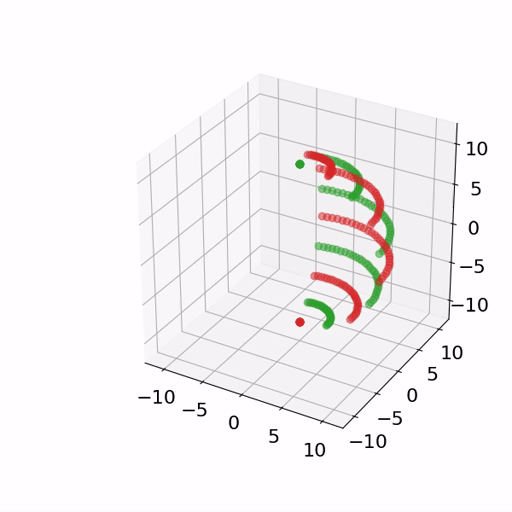
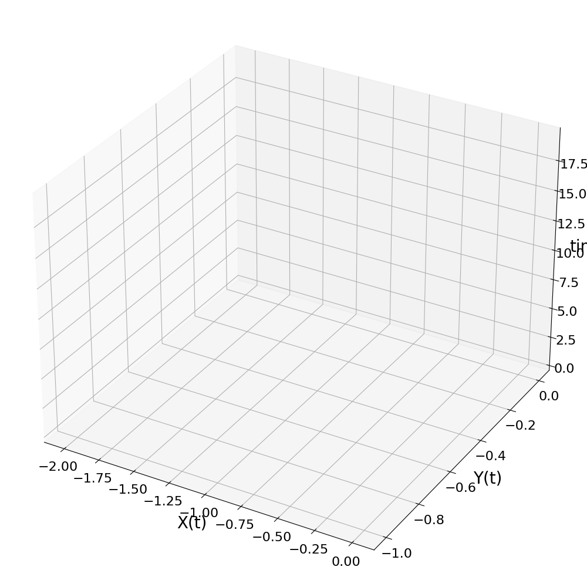

# 3D Plotting #

**To get packages used in current codebase:**
```sh
pip install pipreqs
pipreqs
```
then you can install with:
```py
pip install -r requirements.txt
```

----
To run the listed animations:
- [`point_anim.py`](./point_anim.py)
- [`animation_using_matplotlib.py`](animation_using_matplotlib.py)
- [`asian.py`](asian.py)<br>
the following packages are needed:
```sh
pip install matplotlib==3.3.3 numpy==1.19.5
```
The animation is saved out to [`point_anim.mp4`](point_anim.mp4)

Convert [`point_anim.mp4`](point_anim.mp4) to [`point_anim.gif`](point_anim.gif) using [`./convert_mp4_to_gif.py`](convert_mp4_to_gif.py), for displaying on readme:

**`point_anim.gif`**<br>



**`animation_using_matplotlib.gif`**<br>


**`asian.gif`**<br>


----

----
## Resources ##
[1](https://sabopy.com/py/matplotlib-animation-2/) [MORE animations](https://sabopy.com/py/matplotlib-animation-2/)

[2](https://github.com/pyvista/pyvista/discussions/1820): [https://github.com/pyvista/pyvista/discussions/1820](https://github.com/pyvista/pyvista/discussions/1820)

[3](https://pythonhosted.org/OrbitalPy/examples/plotting/plotting/): [https://pythonhosted.org/OrbitalPy/examples/plotting/plotting/](https://pythonhosted.org/OrbitalPy/examples/plotting/plotting/)
